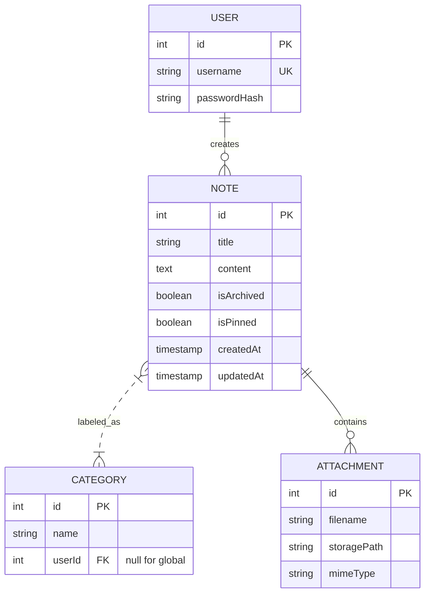

<div align="center">

# RetroNotes

***An all-in-one note-taking application with an old-school 8-bit look and feel.***

This application was created using a containerized monorepo, and the frotend was created using [8bitcn/ui](https://www.8bitcn.com/docs), with small changes.


https://github.com/user-attachments/assets/2c9199db-4307-46bf-8844-423c49e5076d

</div>

## Project Overview

RetroNotes A note-taking system built on an NPM Workspaces monorepo. The stack includes a NestJS backend, a React frontend, and a PostgreSQL database. The environment is containerized via Docker to standardize the development workflow.

### Key Features

* **Authentication:** JWT flow with HTTP-only cookies.
* **Note Management:** Full CRUD with archiving, pinning, and category tagging.
* **8-bit UI System:** Custom-built UI components using Tailwind CSS and Radix UI primitives with a pixelated aesthetic.
* **File Attachments:** Integrated file upload/download system via Multer and local filesystem storage.
* **Local-First Drafts:** Automatic debounced autosave to localStorage to prevent data loss.

## Architecture

### Monorepo Structure

```text
retro-notes/
├── apps/
│   ├── api-server/      # NestJS Backend (Port 3000)
│   └── web-app/         # React Frontend (Port 5173)
├── packages/            # Reserved for shared logic/types
├── docker-compose.yml   # Infrastructure orchestration
├── .env                 # Environment configuration
└── package.json         # Root workspace config

```

### Technology Stack

| Layer | Technologies |
| --- | --- |
| **Backend** | NestJS 11, TypeORM, Passport.js (JWT), PostgreSQL 17 |
| **Frontend** | React 19, Vite 7, TanStack Query 5, React Hook Form, Tailwind 4 |
| **UI/UX** | Radix UI, Lucide Pixel Icons, Sonner, React-Markdown |
| **DevOps** | Docker, Docker Compose, NPM Workspaces |

## Database Schema



## Getting Started

### Prerequisites

* Node.js 20+
* Docker & Docker Compose

### Initial Setup

1. **Clone and Enter:**
```bash
git clone <repo-url>
cd retro-notes

```


2. **Environment Setup:**
```bash
cp .env.example .env
# Update JWT_SECRET and Database credentials in .env

```


3. **Launch Services:**
```bash
# This starts PostgreSQL, API, and Web App
docker-compose up -d

```


4. **Seed Data (Optional):**
```bash
docker-compose exec api-server npm run seed

```

### Local Development (Without Docker)

```bash
npm run install:all
npm run docker:db    # Starts only the DB
npm run dev          # Concurrent backend + frontend start

```

## 8-Bit UI Implementation

The "Retro" feel is achieved through a custom design system:

* **Pixel Borders:** Simulated via CSS `border-x-6` and `border-y-6` on relative containers.
* **Typography:** Integration of "Press Start 2P" via Google Fonts.
* **Component Pattern:** Uses the **Compound Component Pattern** for the Dashboard layout.

## Security

* **Password Hashing:** Bcrypt.
* **JWT Protection:** Tokens are stored in **HttpOnly, SameSite=Lax** cookies to mitigate XSS and CSRF risks.
* **Row-Level Authorization:** All database queries are scoped to the `userId` extracted from the JWT session.

## License

Distributed under the MIT License.
